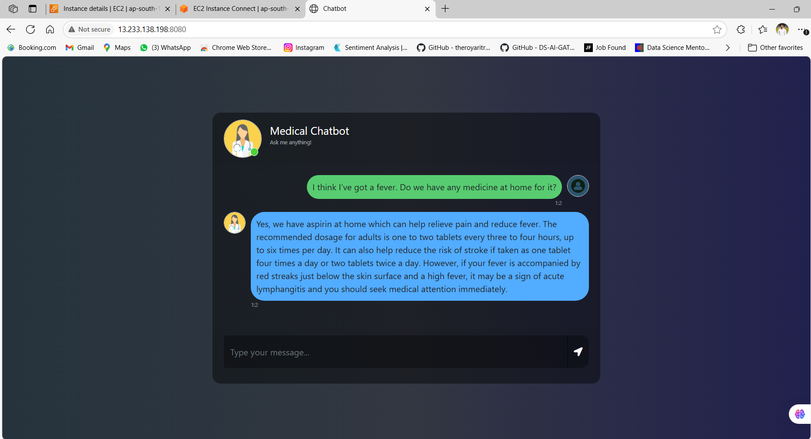

<h1 align="center">🩺 Medical Chatbot</h1>

  <b>Your AI-powered health assistant — medical advice at your fingertips.</b> 
  <i>A conversational chatbot that leverages LangChain, Pinecone, and OpenAI for intelligent, context-aware responses.</i>

---

## 🚀 Project Vision

Access to quick and reliable medical advice can be life-changing.  
But searching through heaps of medical info is time-consuming and often confusing.

🎯 **Mission**: Provide accurate, instant answers to your health queries through natural conversation.  
⚡ **Result**: A seamless medical chatbot that understands your questions and retrieves trustworthy info.

---

## 🧠 The Intelligence Layer

> “Ask health questions naturally — get medically-informed answers.”

Powered by:  
- **OpenAI embeddings (`text-embedding-3-small`)** for semantic understanding  
- **Pinecone Vector Store** for fast, relevant document retrieval  
- **LangChain framework** to orchestrate the conversational pipeline  

---

## 🌐 Who's This For?

| 👥 **Role**          | 💡 **How It Helps**                                           |
|---------------------|--------------------------------------------------------------|
| 🏥 **Patients**      | Quickly get advice on common symptoms and medications        |
| 🩺 **Healthcare Staff**| Assist with quick information retrieval for patient queries |
| 📚 **Medical Students**| Explore medical knowledge interactively                      |

---

## 🚀 Watch It in Action

  
*Running smoothly on AWS EC2 with Docker container deployment.*

---

## 🧰 Behind the Scenes – The Tech Stack

| 🧩 **Layer**            | ⚙️ **Tools & Frameworks**                                        |
|-------------------------|-----------------------------------------------------------------|
| **Embedding & Retrieval** | OpenAI (`text-embedding-3-small`), Pinecone                      |
| **Conversational Logic** | LangChain, ChatPromptTemplate                                    |
| **Backend API**         | Flask app                                                        |
| **Deployment**          | Docker, AWS EC2, AWS ECR, CI/CD with CodeDeploy                 |

---

## ✨ Core Highlights

💬 **Context-Aware Responses**  
→ Uses vector search to retrieve relevant medical info on the fly.

🔒 **Secure & Scalable**  
→ Containerized app deployed on AWS EC2 with Docker for robustness.

⚡ **Efficient Embeddings**  
→ Uses OpenAI’s optimized embedding model for fast and accurate similarity search.

---

## 🧪 Try It Yourself – Run Locally

### 🔧 Step 1: Clone and Setup Backend

---
git clone https://github.com/akashagalave/Medical-Chatbot.git
cd Medical-Chatbot
pip install -r requirements.txt

---

Create a .env file with your API keys:

PINECONE_API_KEY=your_pinecone_api_key
OPENAI_API_KEY=your_openai_api_key

Start the Flask server:

python app.py

---

Built with grit, grind, and ❤️ by [Akash Agalave](https://github.com/akashagalave)

